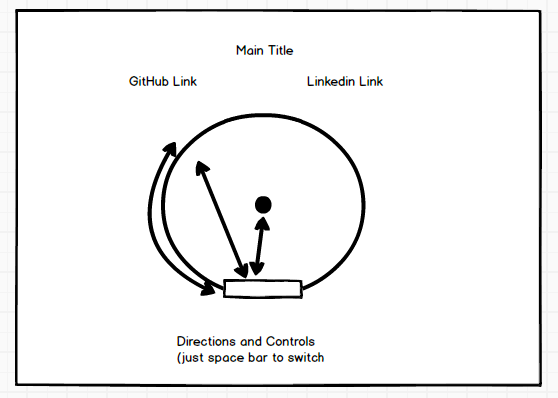

## Circular Pong

#### Background

Circular Pong is a spin off of the original game Pong, but is a single player version.  The idea is that instead of moving side to side to send the ball back to your opponent, you will move your paddle around a circle to hit the ball back towards the middle of the circle.  The goal of the game is to keep the ball in the circle.

#### Functionality & MVP

With Circular Pong, users will be able to :

- [ ] Start the game
- [ ] Choose which direction they want to move their  paddle
- [ ] See their score
- [ ] Mute the music

In addition, Circular Pong will include:

- [ ] A production README

#### Wireframes

This app will consist of a game board and a title.  It will also have links to github and linkedin.

#### Architecture and Technologies

This project will be implemented with the following technologies:

- Vanilla JS
- jquery
- HTML5 Canvas
- Webpack

There will be two script files for thie project:

`board.js`: This script will handle setting up the board to its initial state.

`game.js`: This script will handle the movement of the ball and the paddle.

#### Implementation Timeline

**Day 1**: Setup all necessary Node modules, including getting webpack up and running.  Create `package.json` and `webpack.config.js`.  Construct a skeleton for both `board.js` and `game.js`.  Learn the basics of how Canvas works.

**Day 2**:Complete the `board.js` file to perform the first initial move of the game.  Add enough to the skeleton of the `game.js` to switch directions of the paddle.

**Day 3**: Finish up the `game.js` and `board.js` to handle the collision of the ball and the paddle.

**Day 4**: Style as well as find and fix any bugs that currently exist.

#### Bonus Features

Features that hopefully will be implemented if time allows:

- [ ] Change speed of the ball making it more difficult
- [ ] Change size of the circle
