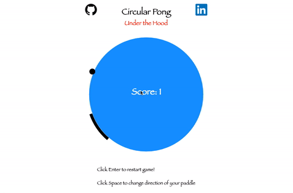

## Circular Pong

#### Background

[Circular Pong](https://stmosher27.github.io/circular_pong/) is a spin off of the original game Pong, but is a single player version.  The idea is that instead of moving side to side to send the ball back to your opponent, you will move your paddle around a circle to hit the ball back towards the middle of the circle.  The goal of the game is to keep the ball in the circle.



#### Implemented Features

With Circular Pong, users can:

- Start the game
- Choose which direction they want to move their
paddle
- See their score

When the user starts a game, the paddle will continuously re-render to update the current position of the player.  The paddle will always being moving in a specified direction.

```js
updatePaddle() {
  if (this.paddleFlag) {
    this.paddleStart += .06;
    this.paddleEnd += .06;
    if (this.paddleStart >= TWO_PI)
      this.paddleStart -= TWO_PI;
    if (this.paddleEnd >= TWO_PI)
      this.paddleEnd -= TWO_PI;
  } else {
    this.paddleStart -= .06;
    this.paddleEnd -= .06;
    if (this.paddleStart <= -TWO_PI){
      this.paddleStart += TWO_PI;
    }
    if (this.paddleEnd <= -TWO_PI)
      this.paddleEnd += TWO_PI;
  }
  this.checkPaddle();
}
```

The checkCollision method is called once the edge of the ball is equal to the distance from the center or radius of the circle.  It then performs checks to distinguish if the ball's angle is within the paddle start and paddle end angle.

```js
checkCollision(){
  let newXPos = this.ball.ballX - this.board.centerX;
  let newYPos = this.ball.ballY - this.board.centerY;
  let disFromCenter = Math.sqrt(Math.pow(newXPos, 2) + Math.pow(newYPos, 2));

  this.player.checkPaddle();

  if (disFromCenter < this.board.boardRadius - this.ball.ballRadius)
  this.collidedWith = true;

  if (disFromCenter >= this.board.boardRadius - this.ball.ballRadius) {
    this.ball.updateAngle(this.board.boardRadius, this.board.centerY);
  }

  this.checkPaddle();

  this.checkSpecialPaddle();

  this.lose();
}
```
Once a collision occurs between the ball and the edge of the circle, the balls angle of contact will be updated in radians based on the unit circle calculation.
```js
updateAngle(radius, centerY) {
  this.ballAngle = Math.asin((Math.abs(this.ballY) -  centerY)/ radius);
  if (this.ballAngle < 0)
    this.ballAngle = Math.abs(this.ballAngle);
  if (this.ballX <= 225 && this.ballY >= 225)
    this.ballAngle = PI - this.ballAngle;
  if (this.ballX < 225 && this.ballY < 225)
    this.ballAngle += PI;
  if (this.ballX >= 225 && this.ballY <= 225)
    this.ballAngle = TWO_PI - this.ballAngle;
  if (this.ballAngle >= TWO_PI)
    this.ballAngle -= TWO_PI;
}
```
The runGame method resets the gameOver variable to false and re-renders the updated state of the game.  Using the setInterval method, the animation of the game is updated every 30 milliseconds.
```js
runGame() {
  this.gameOver = false;
  this.board.drawCircle();

  this.int = setInterval(() => {
    this.board.setBackground();

    this.ball.ballSpeed();

    this.board.drawCircle();
    this.board.clearBorder();

    this.ball.drawBall();

    this.player.updatePaddle();
    this.player.drawPaddle(this.board.boardX, this.board.boardY, this.board.boardRadius);

    this.checkCollision();

  }, 30);
}
```


#### Architecture and Technologies

This project uses the following technologies:

- Vanilla JS
- HTML5 Canvas
- Webpack


#### Bonus Features

Features that hopefully will be implemented in the future:

- Change speed of the ball making it more difficult
- Change size of the circle
